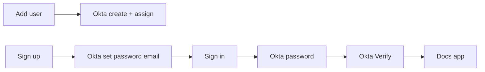

# Okta-only UX (Auth0 thin broker)

**Status:** Single workflow — Auth0 stays as OIDC broker; users only ever authenticate at Okta.  
**Cloudflare Access:** Not used.  
**Canary:** CTIX (`https://apitest1.cyninjadev.com`).

Related: [SSO_INTEGRATION_REPLACEMENT_PLAN.md](./SSO_INTEGRATION_REPLACEMENT_PLAN.md), [AUTH0_INVITE_ONLY.md](../../AUTH0_INVITE_ONLY.md).

---

## Target UX (one path)

| Step | What happens |
|------|----------------|
| Admin **Add user** | Docs invite row + **Okta Users API** creates/assigns the person (no manual Okta People step) |
| First time **Sign up** | User enters invited email → Okta password-setup / activation email → set password → return to Sign in |
| **Sign in** | Auth0 `connection=Okta` → Okta **password** → **Okta Verify** → docs |
| Not invited | Blocked by invite gate |

No Google button. No Auth0 Database login. No Auth0 Duo / Guardian after Okta.



---

## Phase 0 — Dashboard setup (manual)

### 1. Okta

1. OIDC Web Application for Auth0 (e.g. **Cyware Docs Auth0**) — already used as the Auth0 Enterprise connection.
2. Note the **Application ID** (`0oa…`) → app env `OKTA_APP_ID`.
3. Create an **API token** (Admin → Security → API → Tokens) with rights to manage users and app assignments → `OKTA_API_TOKEN`.
4. Org URL e.g. `https://integrator-6909736.okta.com` → `OKTA_ORG_URL`.
5. **App sign-in policy** for Cyware Docs Auth0:
   - **Password + Okta Verify** (knowledge then possession) — not “any 1 factor” alone, and not org-wide weakening of unrelated apps.
6. After password set / activation, users should return to the docs **Sign in** page (set Initiate login URI / bookmark to `https://apitest1.cyninjadev.com/sign-in?hint=set_password_done` where possible).

### 2. Auth0

1. Enable **only** the Okta enterprise connection on the Regular Web Application.
2. **Disable** Google and Database for that application (or leave disabled in UL by never linking without `connection=`).
3. **Security → Multi-factor Auth → Never**. Remove any Post-Login Action that calls `api.multifactor.enable`.
4. Keep Post-Login **invite-check** Action → `POST /api/auth/invite-check`.
5. Callback / logout / web origins unchanged (all four product hosts + localhost).

### 3. App env (Vercel Production + Preview + `.env.local`)

```env
AUTH0_OKTA_CONNECTION=okta   # exact Auth0 connection name
INVITE_SKIP_IDP_PROVISION=true
OKTA_ORG_URL=https://integrator-XXXX.okta.com
OKTA_API_TOKEN=...           # SSWS token
OKTA_APP_ID=0oa...           # Cyware Docs Auth0 application id
```

Sync script copies `AUTH0_OKTA_CONNECTION`, `INVITE_SKIP_IDP_PROVISION`, `OKTA_ORG_URL`, `OKTA_API_TOKEN`, `OKTA_APP_ID`, `AUTH_COOKIE_DOMAIN`.

---

## Sign-in / Sign up (app)

| Control | Behavior |
|---------|----------|
| **Sign in** | `/auth/login?connection={AUTH0_OKTA_CONNECTION}` — password then Okta Verify |
| **Sign up** | `/sign-up` → `POST /api/auth/okta-signup` — sends Okta activation/reset email; **no** OIDC session (avoids loops) |
| `?hint=set_password` | Calm banner: use Sign up first |
| `?hint=set_password_done` | Banner: Sign in with new password + Verify |

`prompt=login` is only added when the page shows an error (retry), not on every hub visit.

---

## Add user

When `OKTA_ORG_URL` + `OKTA_API_TOKEN` + `OKTA_APP_ID` are set:

1. Create Okta user if missing (`activate=false` / STAGED).
2. Assign to `OKTA_APP_ID`.
3. Send activation or reset-password email (`okta_activation_sent` / `okta_provisioned`).
4. Store docs `DocumentationUser` with provisional Auth0 id until first SSO; first Okta login relinks to live `sub`.

---

## Loop prevention

| Risk | Guard |
|------|--------|
| Sign up starts OIDC → deny → loop | Sign up only sends email; session via Sign in only |
| Auth0 Duo after Okta | MFA Never; no multifactor Action |
| Sticky wrong-email on `/` | Hub escape + Browse documentation home logout |
| Double factors | Okta policy password then Verify once |

---

## Smoke checklist

1. Add user in production → user appears in Okta People + app assignment.
2. Sign up with that email → setup email arrives → set password.
3. Sign in → password → Okta Verify → docs.
4. Sign in before password → branded hint to Sign up (not Auth0 Duo).
5. Uninvited email → invite-required / not invited.

## Rollback

1. Clear `OKTA_API_TOKEN` / `OKTA_APP_ID` if you must stop auto-provision.
2. Re-enable Database/Google on Auth0 only if intentionally leaving Okta-only UX.
