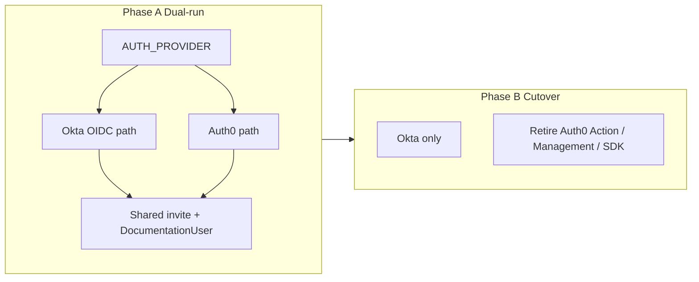

# SSO Integration & Auth0 Replacement Plan

**Status:** Option F selected (2026-07-23) — **Federate Okta into Auth0**; do not replace Auth0 with custom `jose` OIDC in this rollout. Cloudflare Access deferred. Canary = CTIX.  
**Ops runbook:** [OKTA_AUTH0_FEDERATION.md](./OKTA_AUTH0_FEDERATION.md)  
**Source guide:** `SSO_INTEGRATION_GUIDE.md` (Embedding Admin Portal pattern; Okta / OIDC Authorization Code + PKCE).  
**Repo:** `intel-exchange-runnable-docs` (current Auth0-backed documentation workspace).  
**Date:** 2026-07-23

---

## 1. Executive summary

| Dimension | Guide proposes | Current repo | Locked choice |
|-----------|----------------|--------------|---------------|
| Strategy | Custom Okta OIDC BFF | Auth0 OIDC | **Federate Okta → Auth0** |
| Provisioning | IdP users only | Management API | **Okta-first invite (skip IdP create)** |
| Multi-host | Single portal URL | 4 hosts | **Shared cookie Domain after custom domains** |
| Cloudflare | Optional Appendix B | None | **No** |

**Recommended approach:** Do **not** big-bang replace Auth0. Prefer a **dual-run, feature-flagged cutover** (`AUTH_PROVIDER=auth0 | oidc`) that implements the guide’s Okta OIDC BFF **alongside** Auth0, then retires Auth0 only after invite, MFA, and multi-host SSO are proven on OIDC.

**Lower-cost alternative (if Auth0 may stay):** Federate Okta into Auth0 as an Enterprise Connection and keep the existing invite/MFA/Management stack. That satisfies “corporate Okta SSO” without adopting the guide’s custom `jose` stack. Choose this only if eliminating Auth0 is **not** a hard requirement.

---

## 2. What the guide proposes (cited)

Guide sections map as follows:

| Guide § | Content |
|---------|---------|
| **§0** | OIDC over SAML; Cloudflare Access is optional infrastructure (Appendix B), not app SSO |
| **§1** | AuthN (Okta) vs AuthZ (app); BFF; secrets server-only (`OIDC_*`, `JWT_SECRET`) |
| **§2** | Login sequence: state/nonce/PKCE cookie → Okta → callback → verify ID token → authorize → session cookie |
| **§3** | Okta Web App registration; optional `groups` claim; env vars; dependency = **`jose` only** |
| **§4** | Portable modules: `lib/oidc.ts`, login/callback routes, `lib/authz.ts`, `lib/session.ts`, middleware |
| **§5** | Security checklist: PKCE, state, nonce, JWKS, fail-closed authZ, `SameSite=Lax`, open-redirect guard, break-glass, audit |
| **§6–7** | Unit tests + troubleshooting |
| **Appendix B** | Optional Cloudflare Access JWT verification — complementary to app OIDC |

Guide env surface (server-only, never `NEXT_PUBLIC_*`):

```text
OIDC_ISSUER, OIDC_CLIENT_ID, OIDC_CLIENT_SECRET, PORTAL_PUBLIC_URL
SSO_ALLOWED_EMAILS, SSO_ALLOWED_DOMAINS, SSO_REQUIRED_GROUP
JWT_SECRET, SESSION_COOKIE_NAME, SESSION_TTL_HOURS
```

---

## 3. Current Auth0 map (repo)

### 3.1 Identity & SDK

| Path | Role |
|------|------|
| `src/lib/auth0.ts` | Lazy `Auth0Client`; session cookie `SameSite=lax`; `logoutStrategy: "v2"`; copies `amr`/`acr`/`auth_time` from ID token into session; callback → `/post-login` |
| `src/app/auth/[...slug]/route.ts` | Node OAuth handlers; login **HTML bridge** (avoids lost `__txn_*` on 307); transaction restore from DB/file |
| `src/lib/documentation-auth/oauth-route-handlers.ts` | Bridge + absolute logout `returnTo` + transaction cookie persistence |
| `src/lib/documentation-auth/env.ts` | `AUTH0_*` + `APP_BASE_URL` / `AUTH0_BASE_URL` validation |
| `package.json` | `@auth0/nextjs-auth0` `^4.24.0` (no direct `jose` dependency today) |

### 3.2 Sign-in & access UX

| Path | Role |
|------|------|
| `src/app/sign-in/page.tsx` | Public UX; optional Google / company email connections; silent redirect to `/auth/login` when healthy |
| `src/app/post-login/page.tsx` | Invite bootstrap via `getAppSessionResult`; cross-host bounce via `/auth/login` on target hostname |
| `src/app/access/*` | `invite-required`, `invite-expired`, `wrong-email`, `disabled`, `mfa-step-up` |
| `src/app/invite/*` | Invite token acceptance UX |

### 3.3 Authorization (invite-only)

| Path | Role |
|------|------|
| `docs/AUTH0_INVITE_ONLY.md` | Canonical Auth0 + Action + invite ops guide |
| `src/app/api/auth/invite-check/route.ts` | S2S gate for Auth0 **Post-Login Action** (`AUTH0_ACTION_SHARED_SECRET`) |
| `src/lib/documentation-auth/session.ts` | App session: Auth0 identity → DB user / invite / bootstrap owner; denies disabled / uninvited |
| `src/lib/documentation-auth/invite-gate.ts` | (used by invite-check + session) email allow via active user / pending invite / `INITIAL_OWNER_EMAIL` |
| Middleware gate | `src/lib/documentation-auth/proxy-auth.ts` + `middleware-auth.ts` — Auth0 session on protected routes; invite/role enforced in Node handlers |

### 3.4 Provisioning & MFA

| Path | Role |
|------|------|
| `src/lib/auth0-management/service.ts` | Management API: create DB user, password-change ticket, org membership |
| `src/app/api/users/route.ts` (+ invites) | Admin invite → provision Auth0 user + app invite row |
| `src/lib/enterprise/mfa-step-up.ts` | `acr_values` multi-factor; logout-to-origin then forced login |
| `src/app/access/mfa-step-up/route.ts` | Cookie bridge for step-up |
| `src/lib/enterprise/auth-assurance.ts` | `hasPrivilegedMfa` / recent `auth_time` for admin gates (`ADMIN_REQUIRE_MFA`) |

### 3.5 Env & multi-host

Documented in `.env.example` and synced by `scripts/vercel/sync-product-env.mjs`:

| Host / project | Notes |
|----------------|-------|
| `cyware-docs-ctix` → `https://apitest1.cyninjadev.com` | Shared Auth0 app + shared `DATABASE_URL` pattern |
| `cyware-docs-csap` → `https://cyware-docs-csap.vercel.app` | Per-host `APP_BASE_URL` / `AUTH0_BASE_URL` |
| `cyware-docs-cftr` | Same |
| `cyware-docs-orchestrate` | Same |
| Local `http://localhost:3000` | Callback + logout allowlisted |

Shared Auth0 keys today: `AUTH0_SECRET`, issuer, client id/secret, Action secret, Management API client, connections, `INITIAL_OWNER_EMAIL`, invite email (`RESEND_*`).

Optional (mostly off): `CROSS_DOMAIN_SSO_ENABLED`, `AUTH_DOMAIN`, `ADMIN_DOMAIN` (see `docs/enterprise/MULTI_DOMAIN_PHASE0_IMPLEMENTATION_MAP.md`).

---

## 4. Gap analysis — guide vs current

| Concern | Guide | Current | Gap severity for replacement |
|---------|-------|---------|------------------------------|
| Protocol | OIDC + PKCE | OIDC via Auth0 SDK (PKCE handled by SDK) | Low conceptually; high if rewriting handlers |
| AuthZ model | Email/domain/group env | DB invites + roles + Action | **High** — must not replace invite-only with env allowlist alone |
| Session shape | `{ actor: email }` JWT | Auth0 session + `DocumentationUser` (`auth0UserId`, role, status) | **High** — rename/generalize subject ID |
| MFA step-up | IdP only | Explicit ACR logout/login dance | **Medium–High** — reimplement against Okta policies |
| Invite Action | N/A | Auth0 Action → `invite-check` | **High** — move deny into callback/session only |
| User create | N/A | Management API | **High** — Okta SCIM/API or “IdP-only users + invite link” |
| Multi-host SSO | Single portal URL | 4 apps, silent Auth0 SSO across hosts | **High** — shared cookie domain **or** per-host OIDC apps + bounce |
| Transaction cookie quirks | Signed state cookie (stateless) | Auth0 `__txn_*` + HTML bridge + DB restore | Guide pattern **simpler** if we own OIDC |
| Break-glass | Env admin password (suggested) | `AUTH_DISABLED` / test headers / bootstrap owner | Keep + strengthen |
| Cloudflare Access | Optional Appendix B | Not in app code | Out of scope unless infra mandates it |
| Deps | `jose` | `@auth0/nextjs-auth0` | Add `jose`; eventually remove Auth0 SDK |

**Important:** The guide’s `lib/authz.ts` (allowlist/domain/group) is **insufficient** as a drop-in for this product. Cyware docs authZ must remain **invite-validated DocumentationUser roles** (and cold-start `INITIAL_OWNER_EMAIL`). Env domain allowlist may be an **additional** defense-in-depth layer, not a replacement.

---

## 5. Keep / replace / integrate

### 5.1 Keep (product behavior & most of app layer)

- Invite UX, invite tokens (hashed), Resend email, roles/permissions (`viewer` … `owner`).
- `getAppSessionResult` invite bootstrap semantics (`session.ts`), access denial pages under `/access/*`.
- Route policy / API guards / admin MFA **policy** (`auth-assurance.ts`, `ADMIN_REQUIRE_MFA`) — adapt claim sources, not remove gates.
- Audit logging, rate limits on invite-check-like endpoints, CSRF patterns, credential encryption for product API keys.
- Public docs vs authenticated workspace split; `AUTH_DISABLED` / test auth for local & CI.
- Four-product deployment topology and `APP_PRODUCT_ID` / Pinecone namespaces (orthogonal to IdP).
- Security invariants already aligned with guide §5: `SameSite=Lax`, open-redirect guards on `returnTo`, secrets not `NEXT_PUBLIC_*`, fail-closed when misconfigured.

### 5.2 Replace (IdP + OIDC machinery) — when cutting over

| Remove / retire | Replace with (guide-shaped) |
|-----------------|-----------------------------|
| `@auth0/nextjs-auth0` + `src/lib/auth0.ts` | `jose`-based `src/lib/oidc.ts` (discovery, PKCE, JWKS, state cookie) |
| `/auth/login|callback|logout` Auth0 SDK paths | `/api/auth/sso/login`, `/api/auth/sso/callback`, `/api/auth/logout` (or keep `/auth/*` aliases) |
| Auth0 session cookie | App session JWT (`JWT_SECRET` / reuse renamed `AUTH0_SECRET` carefully) |
| Auth0 Post-Login Action + `AUTH0_ACTION_SHARED_SECRET` | Authorize in callback + existing DB invite gate (Action becomes obsolete) |
| Auth0 Management API provisioning | Okta Admin API/SCIM **or** stop creating IdP users (invite email → user must already exist in Okta) |
| Auth0 connection query params (`AUTH0_GOOGLE_CONNECTION`, etc.) | Single “Sign in with Okta” (social/Google via Okta if needed) |
| `auth0UserId` as Auth0-specific identity | Prefer `idp_subject` / keep column storing OIDC `sub` (migration) |

### 5.3 Integrate (new or adapted)

1. **OIDC modules & routes** per guide §4 — adapted to call existing `checkEmailAccess` / session bootstrap instead of env-only `authorize()`.
2. **Claims pipeline:** map Okta ID token → `email`, `sub`, optional `groups`, `amr`/`acr`/`auth_time` for MFA assurance.
3. **MFA step-up:** Okta equivalent of `prompt=login` + ACR / authentication policy; rewrite `/access/mfa-step-up` off Auth0 `/v2/logout`.
4. **Invite flow without Management API:** decide product rule (see §8 blockers).
5. **Multi-host:** either (a) one Okta app with 4+ redirect URIs and shared parent-domain session cookie, or (b) four Okta apps + post-login bounce (today’s Auth0 pattern).
6. **`GET /api/auth/methods`** (guide §4f optional) — feature-flag Auth0 vs Okta buttons during dual-run.
7. **Env & sync script:** extend `scripts/vercel/sync-product-env.mjs` for `OIDC_*` / `JWT_SECRET` / `PORTAL_PUBLIC_URL` per host.
8. **Docs:** supersede or dual-document `docs/AUTH0_INVITE_ONLY.md` → Okta invite-only runbook.
9. **Tests:** port guide §6 unit tests; keep e2e (`e2e/auth.spec.ts`) behind provider flag; update `scripts/verify-mfa-sso-local.mjs`, `scripts/auth-smoke.mjs`.

### 5.4 Do not integrate (unless explicitly required)

- **SAML** (guide §0: avoid).
- **Cloudflare Access as the only login** (Appendix B) — only if Cyware infra already fronts these hosts; can layer later without replacing app OIDC.
- Replacing invite DB with `SSO_ALLOWED_EMAILS` alone.

---

## 6. Recommended strategy: dual-run then replace



**Why dual-run (not big-bang):**

- Four production hosts + shared Postgres invite state; Auth0 outage vs Okta misconfig must be independently rollbackable.
- Invite Action, MFA step-up, and Management API have no 1:1 guide equivalents — need soak time.
- Guide’s session is email-only; this app’s authorization and admin MFA depend on richer session claims.

**Federation-only (Auth0 stays)** remains a valid **Phase 0 shortcut** if the business goal is “users click Okta,” not “remove Auth0.” Document that as Option F in §8.

---

## 7. Ordered implementation phases

### Phase 0 — Decisions & Okta app registration (no app cutover)

1. Confirm IdP: Cyware Okta org issuer URL (`OIDC_ISSUER`).
2. Choose **Replace** (this plan) vs **Federate** (Auth0 Enterprise Connection).
3. Decide invite provisioning model (Okta user must pre-exist vs Okta API create vs SCIM).
4. Decide multi-host session model (shared cookie domain vs per-host OIDC + bounce).
5. Register Okta **OIDC Web Application**; add redirect URIs for all 4 hosts + localhost (`…/api/auth/sso/callback` or chosen path).
6. Optional: `groups` claim if role mapping from Okta is desired later (not required for invite-only).

### Phase 1 — OIDC library + dual routes behind flag

1. Add `jose`; implement `src/lib/oidc.ts` (guide §4a) with `import "server-only"`.
2. Add `/api/auth/sso/login` and `/api/auth/sso/callback` (guide §4b–4c).
3. On success: **do not** stop at email allowlist — call existing invite/session bootstrap (extract shared helper from `session.ts` that takes `{ sub, email, name, amr, acr, authTime }` independent of Auth0).
4. Issue **app session cookie** OR temporarily still bridge into a unified session abstraction (`authProvider: "oidc" | "auth0"`).
5. Feature flag: `AUTH_PROVIDER=auth0` (default) | `oidc` | `both` (methods endpoint).
6. Unit tests for PKCE, state cookie, ID token verify, callback failure modes (guide §6).

### Phase 2 — Middleware & session abstraction

1. Introduce provider-agnostic `getIdpSession` / middleware probe (today `middleware-auth.ts` is Auth0-only).
2. Generalize `AppSession.authProvider` and DB field semantics (`auth0_user_id` → store OIDC `sub`; migration note).
3. Update `proxy-auth.ts` public allowlist for new SSO routes.
4. Keep Auth0 path fully working when flag = `auth0`.

### Phase 3 — AuthZ & invite without Auth0 Action

1. Enforce invite deny in OIDC callback + `getAppSessionResult` (already mostly there).
2. Keep `/api/auth/invite-check` for Auth0 Action during dual-run; document deprecation when Auth0 retired.
3. Optionally add guide-style domain allowlist **in addition to** invite (defense in depth), still fail closed if both empty and no invite path — product must define policy.
4. Audit log success/deny with email + reason (guide §5).

### Phase 4 — MFA step-up on Okta

1. Map `ADMIN_REQUIRE_MFA` / `hasPrivilegedMfa` to Okta `amr`/`acr` (or Okta Assurance).
2. Reimplement `/access/mfa-step-up` without Auth0 logout allowlist quirks (or use Okta logout + re-auth).
3. Extend `scripts/verify-mfa-sso-local.mjs` and role/MFA matrix tests.

### Phase 5 — Provisioning & Users admin

1. Replace or gate `auth0-management/service.ts`:
   - **Preferred for SSO-first:** invites only for emails that will authenticate via Okta; no IdP user create; provisional local row until first login (pattern already partially exists via provisional Auth0 IDs).
   - **If must create users:** Okta Users API / SCIM; new env (`OKTA_API_TOKEN`, etc.).
2. Update Users UI copy (“Auth0” → “SSO” / “Okta”).
3. Password-setup tickets become “complete Okta enrollment” or disappear.

### Phase 6 — Multi-host + local + Vercel env

1. Register all callback/logout URLs in Okta.
2. Per product: `PORTAL_PUBLIC_URL` / `APP_BASE_URL` exact match (guide troubleshooting: wrong public URL breaks prod).
3. Extend `scripts/vercel/sync-product-env.mjs` shared keys for OIDC; keep Auth0 keys until cutover.
4. Cross-host: implement bounce or shared session domain; validate with CTIX ↔ CSAP silent navigation.
5. Local: `http://localhost:3000` redirect URI; document `.env.local` template in `.env.example`.

### Phase 7 — Cutover & retire Auth0

1. Flip default `AUTH_PROVIDER=oidc` on one canary host (e.g. CSAP).
2. Soak: invite, wrong-email, disabled, MFA admin, agent routes, logout.
3. Flip remaining three hosts.
4. Disable Auth0 Action; remove Management credentials from Vercel; uninstall SDK; delete Auth0-specific bridges when unused.
5. Archive `docs/AUTH0_INVITE_ONLY.md` → historical; publish Okta invite-only runbook.
6. Rotate secrets; confirm no Auth0 callbacks remain in dashboards.

### Phase 8 — Hardening & optional Cloudflare

1. Break-glass account path (guide §5) documented and tested.
2. Mock OIDC provider in CI (`oauth2-mock-server` per guide §6).
3. Only if required: Appendix B Cloudflare Access verification **in addition to** app OIDC.

---

## 8. Migration steps — 4 Vercel hosts + local

| Step | Local | Four product projects |
|------|-------|------------------------|
| 1 | Add Okta localhost redirect URI | Add each host’s callback URI to same or per-product Okta app |
| 2 | `.env.local`: `OIDC_*`, `JWT_SECRET`, `AUTH_PROVIDER=both` | Set same via Vercel env / `sync-product-env.mjs` with per-host `PORTAL_PUBLIC_URL`=`APP_BASE_URL` |
| 3 | Keep Auth0 vars for rollback | Do not delete Auth0 vars until Phase 7 |
| 4 | Smoke: `/api/auth/sso/login` → Okta → invite user lands in docs | Canary one project first |
| 5 | MFA + admin | Repeat per host |
| 6 | Cross-product link / post-login bounce | Validate cookie or bounce |
| 7 | Cutover flag | Remove Auth0 Action pointing at canary `APP_BASE_URL` last |

**Rollback (any host):** Set `AUTH_PROVIDER=auth0`, redeploy; Auth0 Action + Management still configured. Do not rotate `AUTH0_SECRET` mid-incident. Okta misconfig does not block Auth0 path during dual-run.

---

## 9. Risk & rollback

| Risk | Impact | Mitigation |
|------|--------|------------|
| Lost invite Action during partial cutover | Uninvited users reach app if only Auth0 Action was denying | App session already denies; ensure OIDC callback never issues session without `checkEmailAccess` |
| Session cookie incompatibility across providers | Users appear logged out switching flags | Force logout on provider flip; short TTL during migration |
| MFA claims missing from Okta tokens | Admins locked out of `/admin` when `ADMIN_REQUIRE_MFA=true` | Keep flag false until claims validated; fail-soft policy already notes missing `auth_time` |
| Multi-host SSO regression | Re-prompt on every product | Design session domain / bounce before cutting CTIX (highest traffic) |
| Management API removal breaks “Add user” | Invites fail | Ship invite-without-provision path first |
| `JWT_SECRET` ≠ old `AUTH0_SECRET` | Confusion / reuse bugs | New name; never log; document rotation |
| SameSite / Secure / `PORTAL_PUBLIC_URL` wrong | Login loop (guide §7) | Checklist from guide; match existing Auth0 base-URL discipline |
| Big-bang remove Auth0 | Extended outage | Dual-run mandatory |

**Rollback checklist:**

1. `AUTH_PROVIDER=auth0` (or unset → Auth0).
2. Redeploy affected Vercel project(s).
3. Confirm Auth0 Allowed Callback/Logout URLs still present.
4. Confirm Post-Login Action still attached (until permanent retirement).
5. Clear browser cookies if mixed session state.

---

## 10. Security checklist mapping (guide §5 → this repo)

| Guide invariant | Current / planned |
|-----------------|-------------------|
| PKCE S256 | Auth0 SDK today; explicit in new `oidc.ts` |
| Signed one-time state | New state cookie; Auth0 `__txn_*` today |
| Nonce in ID token | New verifyIdToken; ensure Auth0 path retains SDK checks |
| JWKS + iss + aud | New `jose` path; do **not** copy `auth0.ts` base64-decode-without-verify for auth decisions (current code only copies claims after SDK session save) |
| Fail-closed authZ | Keep invite-only; do not ship empty allowlist as sole gate |
| Secrets server-only | Already; extend to `OIDC_CLIENT_SECRET` |
| `HttpOnly; Secure; SameSite=Lax` | Already on Auth0 cookies; mirror on app session |
| Open-redirect guard | Already (`safeReturnTo` / `sanitizeNext`) |
| Recovery / break-glass | Document owner bootstrap + `AUTH_DISABLED` limits; add true break-glass if Okta is sole path |
| Audit denials | Extend existing `logDocumentationAuthEvent` |

---

## 11. Blockers / decisions needed from stakeholders

1. **Primary goal:** Eliminate Auth0, or only add Okta SSO for end users?
2. **IdP details:** Okta issuer URL, who owns Admin Console, whether Google stays via Okta or is dropped.
3. **Invite provisioning:** Must the app create Okta users, or are all users pre-provisioned in Okta?
4. **Multi-host session:** Shared parent cookie domain available (e.g. `*.cyninjadev.com`) or keep per-host OIDC + bounce?
5. **MFA:** Is Okta org MFA mandatory for all users, and can admin step-up use Okta policies / ACR compatible with `auth-assurance.ts`?
6. **Timeline / canary host:** Which of the four products cuts over first?
7. **Cloudflare Access:** Is any product host already behind Cloudflare Access (Appendix B), or app-level OIDC only?
8. **Group→role mapping:** Stay invite-assigned roles only, or map Okta `groups` → Documentation roles?

---

## 12. Deliverable outcomes (when implementation starts)

- [ ] `AUTH_PROVIDER` dual-run with Okta OIDC BFF per guide §2–4
- [ ] Invite-only authZ preserved without depending on Auth0 Actions (post-cutover)
- [ ] MFA admin step-up working on Okta
- [ ] Four Vercel hosts + localhost redirect URIs and env sync
- [ ] Documented rollback to Auth0 until retirement
- [ ] Updated `.env.example` + enterprise auth runbook under `docs/enterprise/auth/`
- [ ] Auth0 SDK and Management API removed only after Phase 7 soak

---

## 13. References

| Artifact | Location |
|----------|----------|
| SSO guide (source) | External: `SSO_INTEGRATION_GUIDE.md` |
| Invite-only Auth0 ops | `docs/AUTH0_INVITE_ONLY.md` |
| Env template | `.env.example` |
| Auth0 client | `src/lib/auth0.ts` |
| App session / invite | `src/lib/documentation-auth/session.ts` |
| Invite-check Action API | `src/app/api/auth/invite-check/route.ts` |
| MFA step-up | `src/lib/enterprise/mfa-step-up.ts`, `src/app/access/mfa-step-up/route.ts` |
| Management API | `src/lib/auth0-management/service.ts` |
| Product env sync | `scripts/vercel/sync-product-env.mjs` |
| Multi-domain notes | `docs/enterprise/MULTI_DOMAIN_PHASE0_IMPLEMENTATION_MAP.md` |
