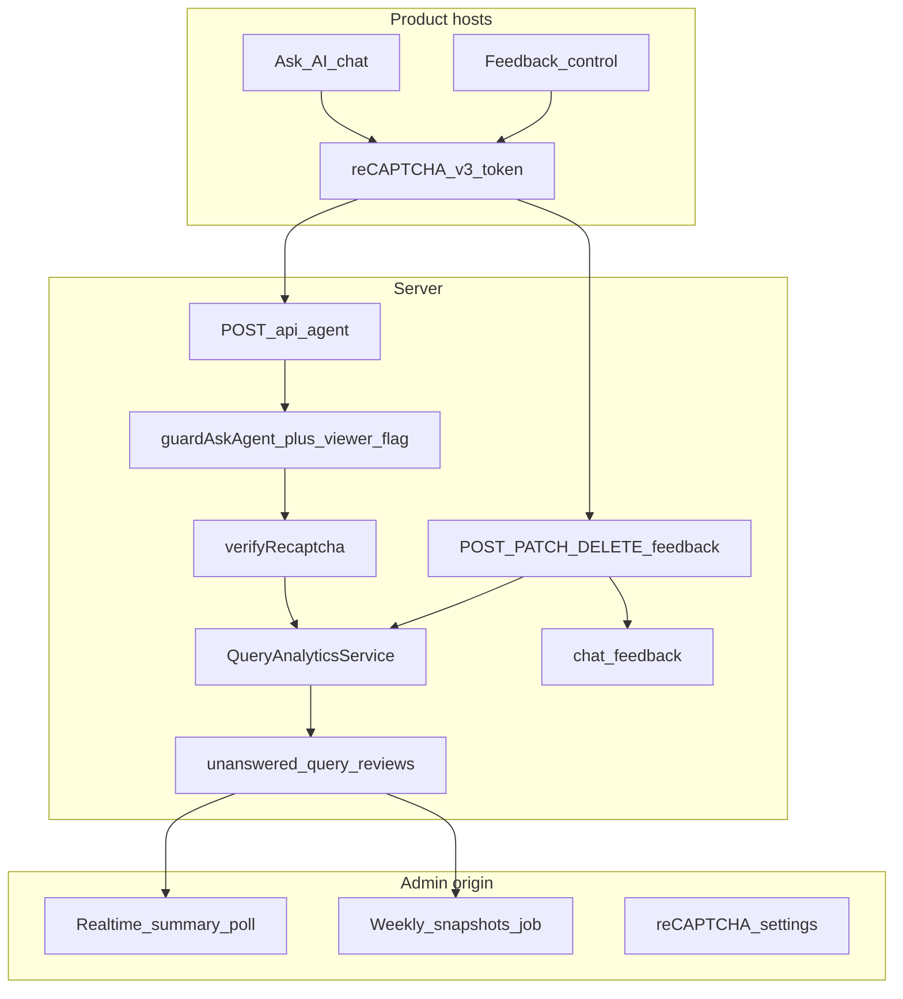

# Feedback, Unanswered Intelligence, reCAPTCHA, Viewer Ask AI

Phase 0 architecture for customer feedback, unanswered-query polish, Google reCAPTCHA v3 abuse protection, and gated Viewer Ask AI. Builds on [Query Analytics architecture](../query-analytics/ARCHITECTURE.md) (migration 010+). Do not duplicate that lifecycle here.

## Call graphs

```text
Ask AI submit
→ guardAskAgent (ask_agent + ai_documentation_assistant + product cred gate
                 + viewer_ask_ai_access_enabled when role=viewer)
→ CSRF + rate limit
→ optional verifyRecaptcha(ask_ai_submit)  [fail-soft if authenticated]
→ persist conversation/turn
→ runAgent (retrieval + model)
→ recordTerminalAnalyticsSafe → unanswered_query_reviews (encrypted)
→ response to client

Feedback (thumbs)
→ guardAskAgent + CSRF + rate limit
→ optional verifyRecaptcha(feedback_submit)
→ chat_feedback upsert (encrypted comment)
→ linkFeedback(logical_query_id) on query_attempts.metadata

Viewer Ask AI OFF
→ hide /agent nav
→ agent page + all agent APIs 403 FEATURE_DISABLED / ACCESS_BLOCKED
→ no unanswered row for access_blocked (classifier already excludes it)

Viewer Ask AI ON
→ ask_agent OK; never test_snippets / Build App / credentials manage
→ UI hides Run; /api/run stays on test_snippets (server deny)

Admin unanswered realtime
→ GET /api/admin/unanswered-queries/summary every 15s
→ counts + status buckets only (no raw query / IP / customer name)

Weekly unanswered
→ job-processor + npm run analytics:weekly-unanswered (CLI defaults to dry-run; `--confirm` to apply)
→ unanswered_weekly_snapshots (aggregates only)
→ admin weekly page + CSV without raw PII by default
```



## Migration 011

Additive only (SQLite + Postgres). Register as `version: 11` in `src/lib/db/migrations/index.ts`.

| Table / change | Role |
|---|---|
| `chat_feedback` | Per-user rating on a final assistant message; unique `(organization_id, user_id, message_id)`; optimistic `version`; encrypted comment columns; FKs to conversation/turn when present |
| `unanswered_weekly_snapshots` | Week-bucket aggregates (counts by outcome/status/product); **no** raw IP/query |
| Extend `unanswered_query_reviews` | Fill any gaps left from 010 (`customer_name_snapshot`, fingerprint, sanitized topic, IP ciphertext, `logical_query_id`) — **no** second unanswered table |

Postgres: `ENABLE` + `FORCE` RLS + tenant policy on `organization_id = current_setting('app.organization_id')`.

## Feature flags

All default **OFF** (not in `DEFAULT_ENABLED`):

| Key | Purpose |
|---|---|
| `chat_feedback` | Thumbs UI + feedback APIs |
| `unanswered_query_sensitive_capture` | Encrypt/store query text + IP on unanswered rows |
| `unanswered_query_realtime_summary` | Admin 15s summary poll |
| `unanswered_query_weekly_analytics` | Weekly snapshot job + admin page |
| `recaptcha_protection` | Verify tokens on Ask AI / feedback |
| `viewer_ask_ai_access_enabled` | Allow Viewer role to use Ask AI |

Env overlays (optional): `RECAPTCHA_*` for site key / secret / min score / allowed hostnames; secret is server-only.

## Permissions

| Permission | Who | Notes |
|---|---|---|
| `unanswered_queries.read` | owner/admin (+ developer sanitized list) | List/summary without decrypt |
| `unanswered_queries.read_sensitive` | owner/admin | Decrypt query/IP; audited; aliases `query_analytics.read_sensitive` |
| `unanswered_queries.export` | owner/admin | CSV without raw PII by default |
| `unanswered_queries.manage` | owner/admin | Status triage (existing) |
| `query_analytics.read_sensitive` | owner/admin | Kept as alias for sensitive read callers |

Viewer: `ask_agent` only when flag ON; never `test_snippets`.

## Security & privacy

- Feedback comments: AES-256-GCM via `encryptSecret` / `decryptSecret`, AAD `feedback:{org}:{feedbackId}`.
- Unanswered query text + client IP: same encryption path as QA architecture (AAD `unanswered:{org}:{logicalQueryId}`).
- Trusted IP: `src/lib/security/client-ip.ts` prefers `x-vercel-forwarded-for`, then last hop of `x-forwarded-for` on Vercel, else `x-real-ip`.
- Customer name: derived server-side from session user (directory → IdP name → email local-part); **never** from request JSON.
- reCAPTCHA: Google v3 invisible; verify score + action + hostname. Authenticated Ask AI **fail-soft** on provider outage (stricter rate limit + degraded banner). Public `/invite` validation **fail-closed** when `RECAPTCHA_PROTECTION_ENABLED=true` (requires `x-recaptcha-token` / action `public_invite`). Auth0 `invite-check` stays shared-secret authenticated (no browser CAPTCHA).
- Pinecone boundary: unanswered + feedback modules must not import embed/upsert/ingest. Unit/grep tests enforce this.
- Realtime poll payloads: counts and status/product buckets only.

## Jobs & ops

```bash
npm run analytics:weekly-unanswered              # dry-run
npm run analytics:weekly-unanswered -- --confirm # upsert snapshots
npm run analytics:outbox                         # existing outbox drain
```

`processControlPlaneJobs` also drains analytics outbox and runs weekly snapshot when the weekly flag is enabled.

## Rollback

1. Turn feature flags off (stops writes/UI).
2. Migration 011 is additive; reverse by dropping `chat_feedback` / `unanswered_weekly_snapshots` after export (ops procedure — never auto-drop in prod).
3. Unanswered queue continues on `unanswered_query_reviews` from 010.
4. Viewer Ask AI OFF restores pre-flag behavior (nav hidden + API reject).

## Staged canary

Flags off by default in production. Enable staging → one product host → remaining products one at a time. Do not claim READY without four-product canary evidence.
