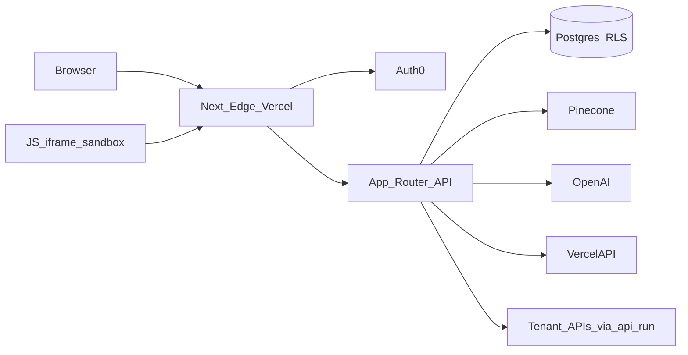

# Security Hardening — Threat Model & DFD

Branch: `enterprise/security-hardening` (from Program 1 ship `f221c06`).

## Actors

| Actor | Capability |
|---|---|
| Unauthenticated internet | Probe public docs, `/api/run`, health |
| Malicious invited user | Session + limited role |
| Compromised viewer | Read docs; no enterprise admin |
| Compromised developer | Staging writes; no prod domain/approve |
| Malicious tenant admin | Org-scoped privileged actions |
| Cross-tenant attacker | IDOR / org header tampering |
| Stolen API credential | Live CTIX/etc. calls via runner |
| Prompt-injection content | Retrieved docs / user chat |
| Supply-chain | npm dependency compromise |

## Assets

Auth0 sessions, roles, tenant DB rows, Pinecone namespaces, SecretKey/AccessID, Vercel tokens, audit logs, conversations, analytics, custom domains, generated apps.

## Trust boundaries

## Controls already in place (Program 1 + prior)

- One login / MFA opt-in for sensitive ops only
- `guardEnterpriseApi` + full authz matrix tests
- CSRF double-submit on mutating admin/user routes
- Baseline CSP + admin noindex headers
- `/api/run` SSRF host allowlist
- No production `dangerouslySetInnerHTML`
- Single guarded `spawn(execPath, argv)`
- Product-pinned vector namespaces

## Program 2 focus

Deepen inventories, close CSRF/route gaps, harden secrets/logging, file/archive, webhooks, rate limits, IR docs, consolidated security regression suite — without login friction.
